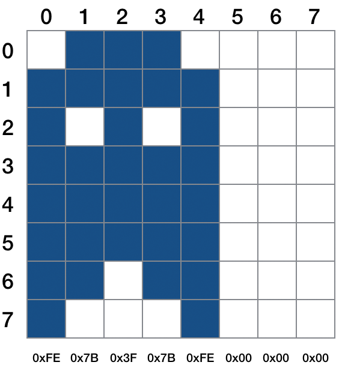

# HT16K33Matrix 3.0.0 #

Hardware driver for [Adafruit 1.2-inch monochrome 8x8 LED matrix display](http://www.adafruit.com/products/1854) based on the Holtek HT16K33 controller. The LED communicates over any imp I&sup2;C bus.

*See [Release Notes](#release-notes) for version information*

## Class Usage ##

### Constructor: HT16K33Matrix(*impI2cBus[, i2cAddress][, debug]*) ###

To instantiate an HT16K33Matrix object pass the I&sup2;C bus to which the display is connected and, optionally, its I&sup2;C address. If no address is passed, the default value, `0x70` will be used. Pass an alternative address if you have changed the display’s address using the solder pads on rear of the LED’s circuit board.

The passed imp I&sup2;C bus must be configured **before** the HT16K33Matrix object is created.

Optionally, you can pass `true` into the *debug* parameter. This will cause debugging information to be posted to the device log. This is disabled by default. **Note** From version 1.4.0, debugging can be enabled or disabled at any time using [*setDebug()*](#setdebugstate).

#### Examples ####

```squirrel
// No debugging
hardware.i2c89.configure(CLOCK_SPEED_400_KHZ);
led <- HT16K33Matrix(hardware.i2c89);
```

```squirrel
// Debugging
hardware.i2c89.configure(CLOCK_SPEED_400_KHZ);
led <- HT16K33Matrix(hardware.i2c89, 0x70, true);
```

## Class Methods ##

### init(*[brightness][, angle]*) ###

Call *init()* to set the matrix’s initial settings. All the parameters are optional.

- *brightness* sets the LED intensity (duty cycle) to a value between 0 (dim) and 15 (maximum); the default is 15.
- *angle* specifies the optional angle by which any image drawn on the matrix will be rotated. You can pass a degree value, which will be converted into the internal format &mdash; 0 (0&deg;), 1 (90&deg;), 2 (180&deg;) or 3 (270&deg;) &mdash; or pass an internal value. Values outside the range -360 to +360 are set to zero.

#### Examples ####

```squirrel
// Set matrix to max brightness and to
// rotate all characters by 180 degrees
led.init(15, 2);
```

```squirrel
// Set matrix to mid brightness and to
// rotate all characters 90 degrees anticlockwise
led.init(8, -90);
```

### displayIcon(*glyphMatrix[, center]*) ###

Call *displayIcon()* to write an non-standard character or graphic to the matrix. The character is passed as an array containing one to eight 8-bit integer values, each value a bit pattern for one of the *columns* making up the character. Each column value’s bits are set or unset according to the diagram below, ie. bit 0 is the bottom pixel of the column and bit 7 is the top
 pixel of the column.



The custom character shown above is formed from five 8-bit values, each representing one of the five columns that make up the character. These five values, shown below each column, form the array passed into *displayIcon()*.

If no array is passed, or an empty or incomplete array is passed, the function returns with no effect.

If `true` is passed into the optional parameter *center*, the glyph will be centered on the matrix.

#### Example ####

```squirrel
// Display a smiley on the matrix
local smiley = "\x3C\x42\xA9\x85\x85\xA9\x42\x3C";
led.displayIcon(smiley);
```

### displayLine(*line*) ###

Call *displayLine()* to write a string to the matrix. The characters (one or more) comprising the string will scroll leftward. If no string is passed, or an empty string is passed, the function returns with no effect.

#### Example ####

```squirrel
// Display 'The quick brown fox...' on the display
local text = "The quick brown fox jumped over the lazy dog";
led.displayline(text);
```

### displayCharacter(*asciiValue[, center]*) ###

Call *displayCharacter()* to write an Ascii character to the matrix. The value is optional; if no value is specified, the display will be set to display a space character. Unless the matrix is set to inverse video mode, this has the same effect as *clearDisplay()*.

#### Example ####

```squirrel
// Set the display to show ‘A’
led.displayCharacter(65);
```

### defineCharacter(*asciiCode, glyphMatrix*) ###

You can save user-defined characters for future use using *defineCharacter()*. The first parameter is a numeric code to identify the character: permitted values are 0 through 31.

The *glyphMatrix* parameter takes an array containing one to eight 8-bit integer values, each value a bit pattern for one of the *columns* making up the character. Each column value’s bits are set or unset according to the diagram below, ie. bit 0 is the topmost pixel of the column and bit 7 is the lowest pixel of the column. See *displayIcon()*, above, for further guidance on forming new characters.

Once defined a user-defined character can be presented using *displayCharacter()* passing in its character code as the *asciiValue* parameter. You can add your characters to a string to be presented by *displayLine()* by adding it as a single-character string:

#### Example ####

```squirrel
local smiley = "\x3C\x42\xA9\x85\x85\xA9\x42\x3C";
local smileyCode = 0;
led.defineCharacter(smileyCode, smiley);

local displayString = "Help! I'm being chased by a...     + smileyCode.tochar() + "    ";
led.displayLine(displayString);
```

### plot(*x, y, color[, xor]*) ###

This method sets the pixel at co-ordinates (x,y) to the specified *color*: 1 (lit) or 0 (dark). If the matrix is in inverse-video mode *(see below)* these color values are automatically inverted.

A call to *plot()* does not update the display immediately, allowing multiple calls to be made before the buffered image is rendered on the display. To do this, call *draw()*. *plot()* returns *this*, allowing multiple calls to be chained

The co-ordinate axis (0,0) is the bottom left of the display.

The optional parameter *xor* is a Boolean value. The default is `false`, but if *xor* is set to `true`, the method will flip the color of the specified pixel if the pixel is already at the requested colour. For example, if the pixel at (1,1) is 1, setting it to 1 will have no effect unless *xor* is `true`, in which case the pixel becomes 0.

#### Example ####

```squirrel
// Draw a border around the matrix edge
for (local x = 0 ; x < 8 ; ++x) {
    if (x == 0 || x == 7) {
        for (local y = 0 ; y < 8 ; ++y) {
            led.plot(x, y, 1);
        }
    } else {
        led.plot(x, 0, 1).plot(x, 7, 1);
    }
}

led.draw();
```

### getIcon() ###

This method returns the display’s buffer should you need to manipulate it directly. Changes made to the buffer by your application code will only be reflected on the LED itself when you subsequently call [*draw()*](#draw).

#### Example ####

```squirrek
local buffer = display.getIcon();
if (isPM) {
    buffer[6] = 0x1E;
    buffer[7] = 0x18;
} else {
    buffer[6] = 0x16;
    buffer[7] = 0x1E;
}
```
### draw() ###

This method causes the contents of the display’s buffer to be rendered on the display. See *plot()* for more information.

### clearDisplay() ###

Call *clearDisplay()* to blank the matrix.

### setInverseVideo(*state*) ###

Call *setInverseVideo()* to specify whether the characters on the matrix should be displayed in inverse video (dark on light) or standard video (light on dark). Pass `true` to select inverse video mode, `false` to select standard video. If no value is passed, inverse mode is selected automatically.

#### Example ####

```squirrel
// Display 'The quick brown fox...' on the display in standard...
local text = "The quick brown fox jumped over the lazy dog";
led.displayline(text);

// ...and in inverse video
led.setInverseVideo(true);
led.displayLine(text);
```

### setBrightness(*brightness*) ###

Call *setBrightness()* to set the matrix’s brightness (duty cycle) to a value between 0 (dim) and 15 (maximum). The value is optional; the matrix will be set to maximum brightness if no value is passed.

#### Example ####

```squirrel
// Set the display brightness to 50%
led.setBrightness(8);
```

### setDisplayFlash(*flashRate*) ###

This method can be used to flash the display. The value passed into *flashRate* is the flash rate in Hertz. This value must be one of the following values, fixed by the HT16K33 controller: 0.5Hz, 1Hz or 2Hz. You can also pass in 0 to disable flashing, and this is the default value.

#### Example ####

```squirrel
// Blink the display every second
led.setDisplayFlash(1);
```

### setDebug(*[state][, showI2Caddress]*) ###

This method can be used to set or unset (pass in `true` or `false`, respectively) the logging of extra information for debugging (see the [Constructor](#class-usage)). The default value of *state*  is `true`.

The second parameter can be used to add the matrix’s I&sup2;C address to its log output. This is handy for multi-matrix displays if you need to differentiate between each matrix. The default value of *showI2Caddress*  is `true`.

#### Example ####

```squirrel
// Enable debugging for a one-LED device
led.setDebug(true, false);
```

### powerDown() ###

The display can be turned off by calling *powerDown()*.

### powerUp() ###

The display can be turned on by calling *powerUp()*.

## Release Notes ##

- 3.0.0 *Unreleased*
    - Refactor the pixel-processing column ops.
    - Move LED co-ordinate origin to bottom left (from top left).
    - Add [*getIcon()*](#geticon) method.
- 2.0.0 *01 March 2019*
    - Namespace matrix constants via *HT16K33_MATRIX_CLASS* enum.
- 1.4.1 *31 January 2019*
    - Reduce width of minus character.
- 1.4.0 *19 December 2018*
    - Add *setDisplayFlash()* method.
    - Add *setDebug()* method
    - Further inverse video fixes.
- 1.3.1 *22 November 2018*
    - Fix inverse video
- 1.3.0 *16 November 2018*
    - Optimisations: use blobs and strings in place of arrays where possible.
- 1.2.6 *June 2018*
    - Code improvements; additional comments.
- 1.2.5 *May 2018*
    - Add support for [`seriallog.nut`](https://github.com/smittytone/generic/blob/master/seriallog.nut) to enable serial logging if the application makes use of it.
        - **Note** Class will log to *server.log()* if *seriallog* is not present.
- 1.2.4 *March 2018*
    - Store user-definable characters in a table rather than an array to conserve memory.
- 1.2.3 *October 2017*
    - Minor code change: rename constants to be class-specific.
- 1.2.2 *May 2017*
    - Streamline brightness control as per other HT16K33 libraries.
- 1.2.1 *April 2017*
    - Rename *defineChar()* and *displayChar()*, respectively, *defineCharacter()* and *displayCharacter()*. The old method names are retained for backward compatibility.
- 1.2.0
    - Add *plot()* method.
    - Add *draw()* method.
    - Moved handling of matrix rotation from each method to the final output method.
- 1.1.0
    - The class incorporates its own Ascii character set, from 32 (&nbsp;) to 127 (&deg;). This character set is now proportionally spaced for a more aesthetically pleasing output. Code built using version 1.0.0 should be checked, especially if you are assuming non-proportionally spaced characters. Ascii code 127 is now a degrees sign, not a copyright symbol.
    - The class now supports up to 32 user-definable characters, assigned to the Ascii code values 0 through 31.
    - The optional angle passed into the second parameter of *init()* may now be a value in degrees, but this will not cause problems for existing code. However, *displayIcon()* now takes an array of 1-8 8-bit values, each specifying a *column* (bit 7 at the top) of the character, not a row.
- 1.0.0
    - Initial release.

## License ##

The HTK16K33Matrix library is licensed under the [MIT License](./LICENSE).
